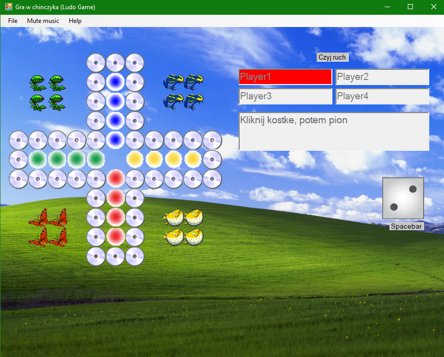
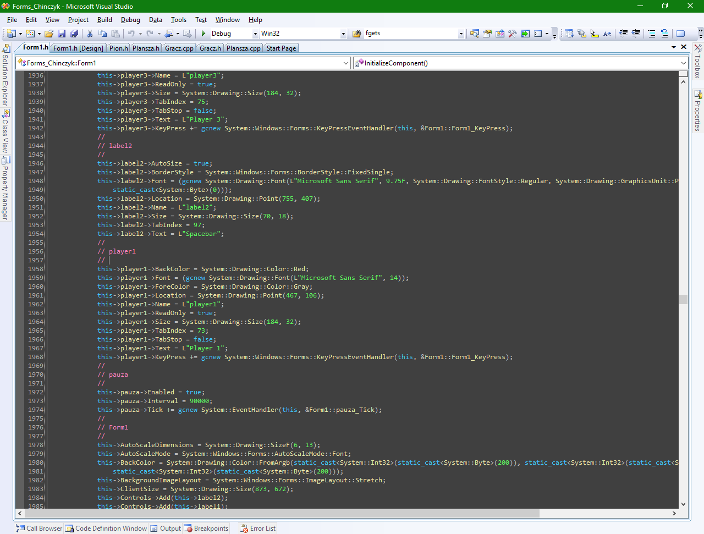

# KrystianLudo - WinForms C++ Game with Sounds.

## A demonstration of my programming skills in winter 2020/2021.
 
 <!---
  markdown picture syntax

  example

-->

Fig 1: 'Windows XP' Skin

Fig 2: Properties of map elements
